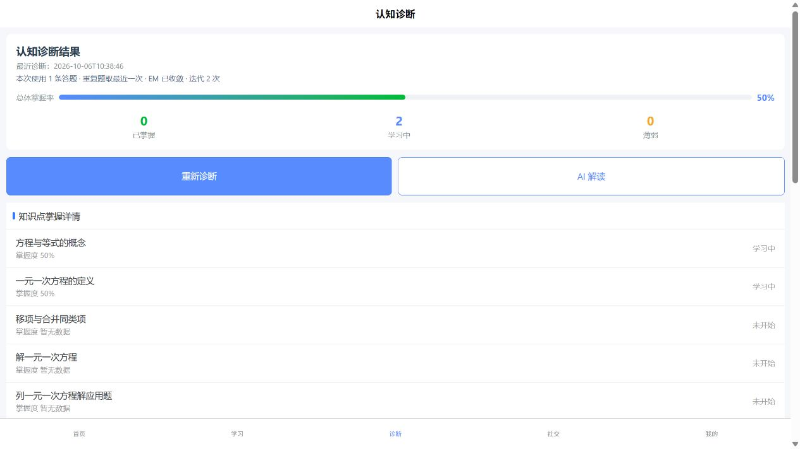
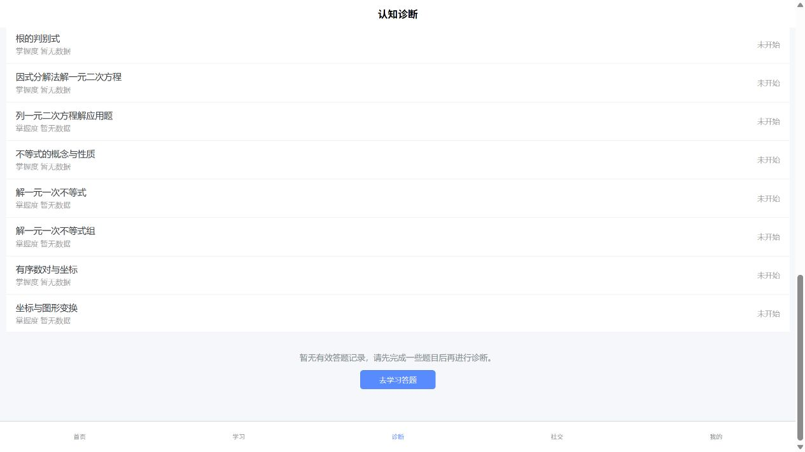

# M0 验收记录：M7-R1 复验

> 验收日期：2026-10-06（Asia/Shanghai）  
> 验收窗口：M01 / M0  
> 最终结论：**三个原返修缺陷已通过；学习入口仍不可用，退回单项 M7-R2。**

## 1. 范围与环境

对照 M7-R1 卡、V2 契约与 M0 验收手册独立验证。保留 M7 首验已通过的聚合、隔离、迁移、事务与算法结论，不修改业务实现、不重置或清理 Git 工作区。

本机 SQL Server 集成认证与 Neo4j 均正常，`/health` 返回 `code=0`、双库 `true`。SQL ledger 为 `0001/0002`，0002 的 **7 个新增追踪列**齐全；答题数使用原有 `question_count`，不是第 8 个新增列。首次验收记录中“8 个字段”的表述已据此纠正。

核对端口、命令与工作目录后，将旧后端实例精确重启到当前代码；学生 H5 原未监听 8080，已在 `frontend/` 启动现有开发服务。日志保存在 `server/.runtime/m01-m7r1-*-20261006.*.log`。不在记录中保存密码、Token 或连接串。

## 2. 独立自动化门禁

| 检查 | M0 实测结果 |
|---|---|
| `python -m pytest tests/test_dina_diagnosis.py -q -p no:cacheprovider --basetemp ../.runtime/pytest-m01-m7r1-dina-20261006-01` | `40 passed, 1 warning`，exit 0 |
| `python -m pytest tests -q -p no:cacheprovider --basetemp ../.runtime/pytest-m01-m7r1-full-20261006-01` | `339 passed, 1 warning`，exit 0 |
| `npm.cmd run build:h5` | `DONE Build complete`，exit 0 |
| `npm.cmd run build:mp-weixin` | `DONE Build complete`，exit 0 |

pytest 唯一警告为既有 Starlette/httpx 弃用提示。构建通过不等同于微信真机验证，也不能替代按钮实操。

## 3. 真实 API / SQL

使用唯一批次 `m01m7r1_20261006103451` 的三个临时学生，全部已清理。

| 场景 | 现场证据 |
|---|---|
| A：`q_001` 先错后对 | SQL 保留两条 attempt；诊断 `answer_count=1`，`latest_attempt`；mastery 两项均 `questions_done=2/correct_count=1` |
| A：POST → GET | `alpha_vector`、诊断时间及整个 trace 相等；`dina-v1/default-v1`、答题范围 `2026-10-06T10:34:53`、收敛 true、迭代 2 次 |
| A：页面再次 POST → GET → 刷新 | 最近诊断 `2026-10-06T10:38:46`；同样显示 1 条、最近一次、已收敛、迭代 2 次 |
| B：无作答 | GET `data=null`，POST `40002`；SQL 无诊断或掌握记录，未串到 A 的数据 |
| C：旧会话兼容 | 仅为临时 C 插入旧字段形态会话，保留迁移默认版本/策略，答题时间范围 NULL；GET 返回 `kp_001=0.72`、历史时间，trace 缺失 |

C 是在真实数据库中构造的可丢弃历史兼容样本，不是修改既有历史学生。新 trace 恢复与旧行判定、旧两列适配器及学生隔离均有独立测试。A 首次 POST 约 38 ms，仅代表小数据量现场，不外推大规模性能。

## 4. H5 实操与原缺陷关闭

1. A 登录进入诊断页，能看到 22 个真实知识点及 GET 恢复的 trace。
2. 点击“重新诊断”，成功 Toast 出现，随后的 GET 没有清空 trace；刷新后仍恢复相同时间与摘要。
3. 有掌握值的知识点显示“掌握度 50%”，未开始项显示“掌握度 暂无数据”，不再误标正确率。
4. B 初次进入诊断页，即使 22 项列表非空，列表下方也有主体不足原因。点击重诊返回 40002；Toast 消失后，该主体提示与按钮仍在，非短暂通知。

由此关闭 M7-R1 原三个缺陷：GET/刷新 trace 恢复、持久不足原因、mastery 文案与 null 语义。

## 5. 剩余缺陷：M7-R2-01（P1）学习入口不跳转

复现：无作答 B → 诊断 → 重新诊断返回 40002 → 滚到主体提示 → 点击“去学习答题”。URL 和页面仍为 `/pages/diagnosis/index`，控制台出现导航错误；点击底部“学习”则正常进入 `/pages/learning/index`，说明目标页面及服务可达。

根因证据：`frontend/src/pages/diagnosis/index.vue:177-178` 的 `goLearning()` 对学习页调用 `uni.navigateTo`；`frontend/src/pages.json:114` 将该页注册为 tabBar。当前安装的 UniApp H5 实现 `node_modules/@dcloudio/uni-h5/dist/uni-h5.es.js:6025-6027` 明确拒绝用 navigateTo 打开 tabBar 页面。应使用 `uni.switchTab`。

这不是样式或文案问题，而是本次新增的不足状态引导交互失效。R1 要求的学习入口尚未形成可用交互，按 M0 前端门禁退回单项 [M7-R2 卡](../tasks/M7-R2-诊断不足状态学习入口返修卡.md)。不要求重写已通过的后端与诊断展示。

## 6. 数据清理与保护

按三个精确用户名与已核对 user_id 在一个事务中清理，目标数不是 3 时直接中止：

| 表 | 本批清理前 | 清理后 |
|---|---:|---:|
| users | 3 | 0 |
| answer_records | 2 | 0 |
| diagnosis_sessions | 3 | 0 |
| user_kp_mastery | 2 | 0 |
| weekly_reports / user_achievements / check_ins | 均 0 | 均 0 |

全库 users / answers / diagnoses / mastery 恢复为验收前的 **9 / 5 / 3 / 7**。没有删除或改写题目、Q 矩阵、Neo4j 数据或非本批用户；测试登录标签页已关闭。

## 7. M0 结论

**M7-R1 三个原返修缺陷均已通过独立验收，但 M7 尚未最终通过。**只返修学习入口路由错误并补实际点击、页面到达及受影响回归证据，随后申请 M0 复验 M7-R2。M6/M8 完整验收继续等待 M7 最终通过。
