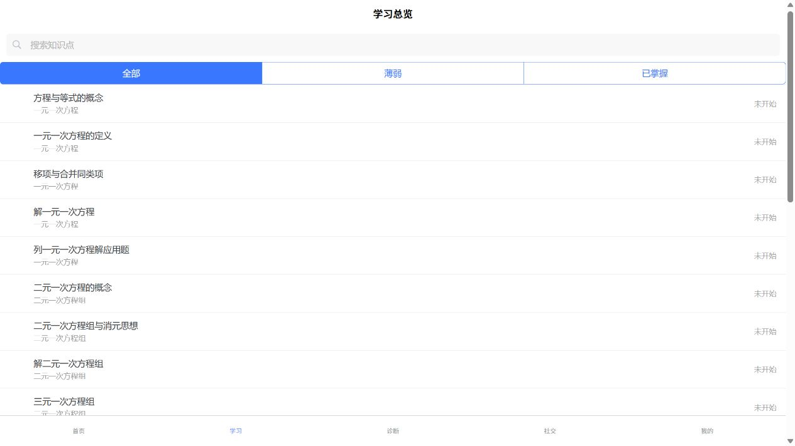
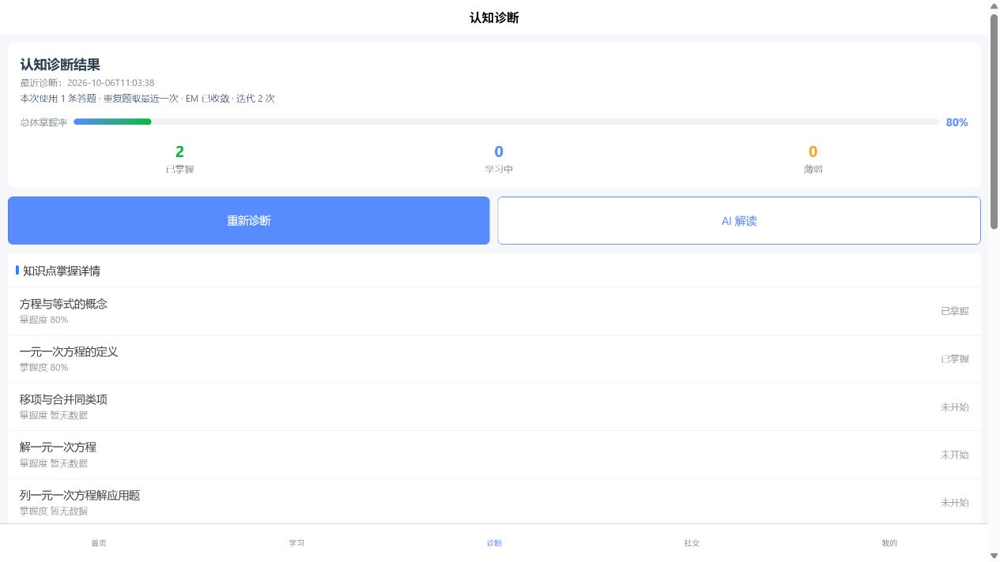

# M0 验收记录：M7-R2 实际点击复验

> 日期：2026-10-06（Asia/Shanghai）  
> 验收窗口：M01 / M0  
> 结论：**R2 导航缺陷已关闭；完整入口链路退回单项 M7-R3，M7 尚未最终通过。**

## 1. 范围与环境

对照 M7-R2 卡实际验证首次不足状态、40002 后跳转、学习 tab 选中、知识点/答题入口与返回状态，并回归 trace 和 mastery。M0 未修改业务代码或数据库结构，未重置/清理 Git 工作区。

交付方记录当时无服务；本次现场已发现 8000/8080 有正确 Uvicorn/UniApp 实例，故沿用现有服务，未重复启动或重启。健康检查 `code=0`、SQL Server/Neo4j 均 true。通过本机 Windows 集成身份查询的基线为 users / answers / diagnoses / mastery = **9 / 5 / 3 / 7**。

## 2. 独立门禁

| 命令 | M0 实测 |
|---|---|
| `npm --prefix frontend run verify:diagnosis-entry` | PASS：`uni.switchTab -> /pages/learning/index` |
| `npm --prefix frontend run build:h5` | `DONE Build complete`，exit 0 |
| `npm --prefix frontend run build:mp-weixin` | `DONE Build complete`，exit 0 |
| DINA 专项（`--basetemp ../.runtime/pytest-m01-m7r2-dina-20261006-01`） | `40 passed, 1 warning` |
| 后端全量（`--basetemp ../.runtime/pytest-m01-m7r2-full-20261006-01`） | `339 passed, 1 warning`，exit 0 |

pytest 在 `server/` 执行，均使用 `-q -p no:cacheprovider`。虽然卡允许无后端改动时沿用旧证据，本次仍补跑并确认无回归。唯一 pytest 警告为既有 Starlette/httpx 弃用提示。

## 3. 真实点击中通过的部分

使用唯一临时学生 `m01m7r2_20261006105940`（`stu_4886b4d3`），通过正式注册/登录接口与 H5 登录。密码和 Token 不写入文档。

1. 无作答首次进入诊断页，22 项知识点显示“掌握度 暂无数据”，主体有不足原因和按钮。实际点击“去学习答题”，到达 `/pages/learning/index`，学习总览加载真实知识点，底部“学习”蓝色选中。
2. 返回诊断，点击“重新诊断”，收到不足业务提示；另以该学生正式 API 核对 POST `40002`、GET `data=null`，SQL attempts / sessions / mastery 均 0，无半写。
3. Toast 消失后，主体原因仍在。再次点击“去学习答题”，实际到达同一学习总览，学习 tab 正确选中。
4. 返回诊断并等待加载后，仍为当前学生的不足状态，无最近诊断、无他人 trace，学习按钮保留。

**M7-R2-01 的 tabBar 导航错误关闭**，无需再次返修 switchTab。

## 4. 剩余 P1：学习列表条目不触发详情跳转

在上述按钮进入的学习总览，真实点击“方程与等式的概念”。点击完成后 URL 仍为 `/pages/learning/index`，页面无变化，控制台无导航错误；未到达详情，因此也不能把此操作写成已进入答题入口。

代码证据：

- `frontend/src/pages/learning/index.vue:12-17` 给 `uni-list-item` 注册 `@click="goDetail(item.id)"`，却没有 `clickable`、`link` 或 `to`。
- 当前安装的 `uni-list-item.vue:106-108` 中 clickable 默认 false，link 默认 false、to 默认空。
- 该组件 `onClick()` 在 `:278-279` 只有 clickable/link 为真时才 emit click；因此业务 `goDetail()` 没有被调用。

这属于**既有列表交互缺陷，不是本次 switchTab 修改导致的回归**。但 M7-R2 卡明确要求实际到达知识点/答题入口，当前整条不足状态引导链路仍不满足。只进入 [M7-R3 单项链路卡](../tasks/M7-R3-学习总览知识点点击链路返修卡.md)，不得重写诊断后端或重新否定已通过的导航/展示项。M2 已通过的正式取题、服务端判题与落库结论，以及 M4 已通过的路径详情链路保持不变。

## 5. 成功 trace / mastery 影响范围回归

为避免用绕过点击掩盖第 4 节失败，成功回归数据**明确由正式 API 准备**：临时学生取到 `q_001`，提交返回选项中的第一项，再 POST 诊断。

- 判题/POST/GET 业务码均 0，POST 与 GET 整个 trace 相等。
- `dina-v1/default-v1`、answer_count 1、latest_attempt、converged true、iterations 2。
- 答题范围与最近诊断均为 `2026-10-06T11:03:38`。
- 实际刷新诊断页后摘要保持，两个有数据项“掌握度 80%”，其他项“掌握度 暂无数据”，不足引导消失。

这证明诊断展示无回归，**不构成学习列表→详情→答题的点击通过证据**。

## 6. 精确清理与原生平台限制

先关闭测试标签页，再在一个事务内按精确 username + user_id 清理；目标数不是 1 时中止。

| 本批记录 | 清理前 | 清理后 |
|---|---:|---:|
| users | 1 | 0 |
| answer_records | 1 | 0 |
| diagnosis_sessions | 1 | 0 |
| user_kp_mastery | 2 | 0 |
| weekly_reports / user_achievements / check_ins | 均 0 | 均 0 |

全库恢复 **9 / 5 / 3 / 7**，本批残留 0。未修改既有用户、题目、Q 矩阵或图谱。被删除的是可丢弃临时测试数据，不保留还原快照；后续可按新批次重新生成。

微信开发者工具/真机本轮未执行，以上截图仅为 H5；保留既有发布前原生烟雾检查，不把小程序构建成功写成原生点击成功。

## 7. M0 最终裁决

**退回剩余学习条目点击链路，进入 M7-R3。**R2 原导航项通过且关闭，测试/构建、40002、trace、mastery 与清理全部通过。M7-R3 实际贯通学习列表→详情→答题并完成受影响回归后，才可将 M7 最终关闭和放行 M6/M8 完整验收。
