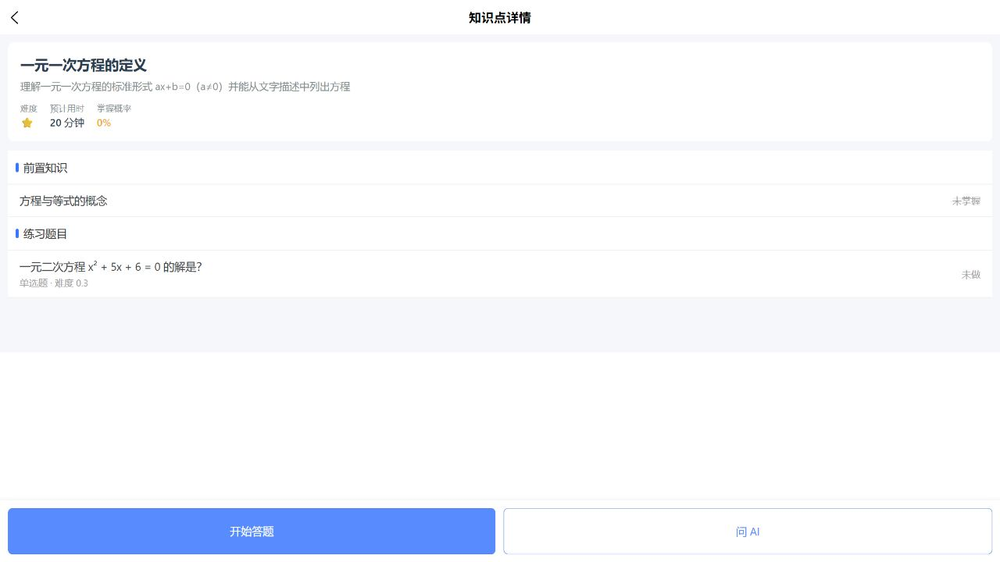
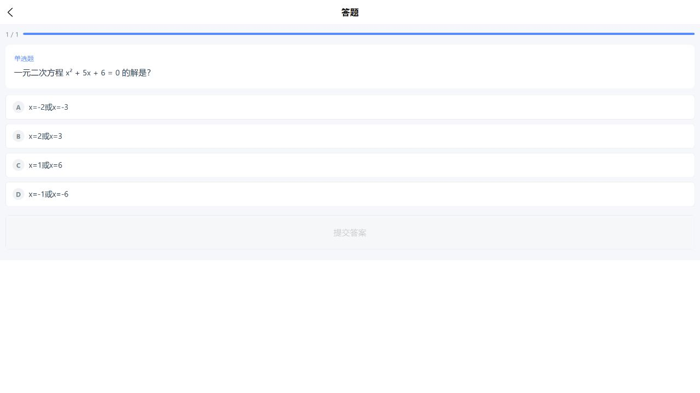
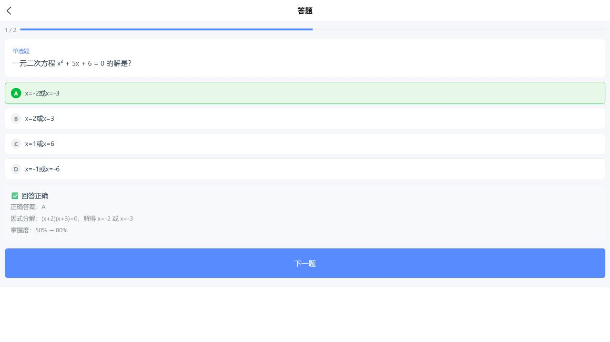
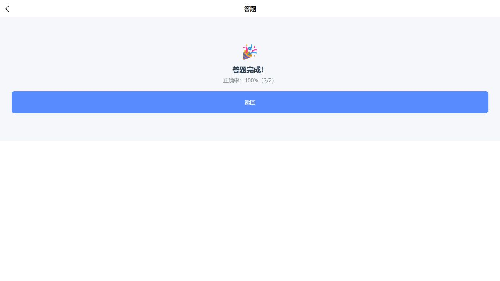
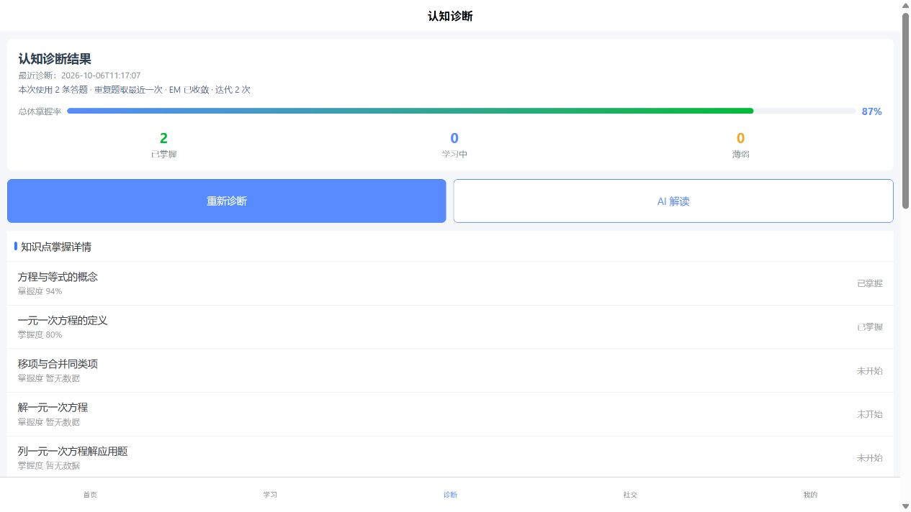

# M0 验收记录：M7-R3 实际链路复验与 M7 最终关闭

> 日期：2026-10-06（Asia/Shanghai）  
> 验收窗口：M01 / M0  
> 最终结论：**M7-R3 通过，M7 最终通过。放行 M6/M8 按依赖推进与完整验收。**

## 1. 范围与基线

对照 M7-R3 卡实际验证“诊断不足 → 学习列表 → 真实知识点详情 → 正式题目 → 页面提交判题 → 返回诊断重诊 → 刷新”。保留首验及 R1/R2 已通过部分，不引入筛选/分页、AI 解读或算法重构。

现场已有正确的 8000 Uvicorn / 8080 UniApp 实例，无需另启或重启。`/health` 为 code 0、SQL Server/Neo4j true。数据库基线 users / answers / diagnoses / mastery = **9 / 5 / 3 / 7**。M0 未修改业务实现、表结构或 Git 暂存区，未清理旧工作树产物。

## 2. 独立门禁与沿用证据

| 检查 | 本轮结果 |
|---|---|
| `npm --prefix frontend run verify:diagnosis-entry` | PASS：switchTab → 学习 tabBar 页 |
| `npm --prefix frontend run verify:learning-entry` | PASS：clickable → detail?id=item.id |
| `npm --prefix frontend run build:h5` | exit 0 |
| `npm --prefix frontend run build:mp-weixin` | exit 0 |
| 后端 DINA 专项 / 全量 | 沿用 M0 [R2 独立复验](2026-10-06-M7-R2复验.md) 的 **40 / 339 passed**；本轮未重跑 |

后端未修改，依卡沿用上述证据。入口检查是轻量源码门禁，真实通过依据是下列页面操作和 SQL，不以正则检查代替点击。

## 3. 唯一批次与首入链路

临时学生：`m01m7r3_20261006111333` / `stu_b26dffd2`。通过正式注册接口创建，再在 H5 登录；不保存密码或 Token。

1. 首次进入诊断：22 项知识点为未开始，“掌握度 暂无数据”，主体不足原因及“去学习答题”可见。
2. 实际点击按钮到学习总览，点击第二条“一元一次方程的定义”，URL 为 `/pages/learning/detail?id=kp_002`，加载当前知识点详情。
3. 点击“开始答题”，URL 为 `/pages/quiz/quiz?knowledge_point_id=kp_002`，看到正式题目与选项。
4. 此轮只查看、不提交，按页面返回链路回到学习总览和诊断，仍保持无作答状态。

## 4. 40002 后完整点击与正式提交

1. 页面点击“重新诊断”收到不足提示；以同一学生接口补核 POST **40002**、GET data null，SQL answers / diagnoses / mastery 均 0，无半写。
2. Toast 消失后，主体原因与按钮仍可见；点击按钮进入学习总览。
3. 点击第一条“方程与等式的概念”，实际进入 `detail?id=kp_001`，再点击“开始答题”进入 `quiz?knowledge_point_id=kp_001`。
4. 从页面选择并提交第一题单选 A，服务端返回回答正确、答案与解析、掌握度 50% → 80%。
5. 点击下一题，页面选择多选 A/C 并提交，服务端返回正确、掌握度 80% → 94%。点击“完成答题”，显示 100%（2/2）。
6. 点击“返回”到详情，掌握概率已刷新为 94%，两道题显示已做；再返回学习总览和诊断。

**两种条目实际分别到达 kp_002 与 kp_001，真实 ID 不是固定值。**没有直接输入详情/答题 URL，没有用 API 提交作答或生成成功诊断来绕过链路。API 仅用于注册、认证、无记录错误核对及成功后的读取。

## 5. 真实 SQL 与诊断刷新

SQL 按当前临时 user_id 核对：

| 记录 | 实际值 |
|---|---|
| q_001 作答 | A，is_correct=1，`2026-10-06 11:16:21.803` |
| q_002 作答 | A,C，is_correct=1，`2026-10-06 11:16:44.140` |
| kp_001 mastery | 0.941176，questions_done=2，correct_count=2 |
| kp_002 mastery | 0.8，questions_done=1，correct_count=1 |

回到诊断并加载后，页面准确显示“已有掌握度快照，但还没有诊断会话”。实际点击“重新诊断”成功：

- 最近诊断 `2026-10-06T11:17:07`，GET code 0。
- trace：`dina-v1/default-v1`、answer_count 2、latest_attempt、converged true、iterations 2。
- 答题范围 `2026-10-06T11:16:21` 至 `2026-10-06T11:16:44`；GET 与 SQL 保存值一致。
- 刷新后摘要与最近诊断时间仍在；两项显示“掌握度 94% / 80%”，其他项“掌握度 暂无数据”。
- 总体 87%、已掌握 2 项；不足原因和快照提示均消失，“去学习答题”元素数量为 0。

## 6. 精确清理

关闭测试登录标签页后，在一个事务内按精确 username + user_id 从属表先删、用户后删；目标数不是 1 则中止。

| 本批数据 | 清理前 | 清理后 |
|---|---:|---:|
| users | 1 | 0 |
| answer_records | 2 | 0 |
| diagnosis_sessions | 1 | 0 |
| user_kp_mastery | 2 | 0 |
| weekly_reports / user_achievements / check_ins | 均 0 | 均 0 |

全库恢复 **9 / 5 / 3 / 7**，本批残留 0。未改变既有用户、题目、Q 矩阵或 Neo4j 数据。临时数据是可丢弃样本，未保留还原快照，后续按新批次重新生成。

## 7. M0 最终裁决与保留项

**通过 M7-R3，M7 最终关闭。**原学习列表 P1 缺陷已关闭；R2 导航与 R1 trace/持久不足提示/mastery 文案均无回归，真实作答到诊断链路和清理证据完整。首验已通过的 latest_attempt、隔离、迁移、参数、事务和性能范围结论保留，不重写或外推。

放行 M6/M8 的依赖推进与完整验收，但本记录不代表它们已通过，也不代表项目整体收口。M9 AI 解读/答疑/周报不在 M7 范围内。

微信开发者工具/真机本轮未执行；所有截图为 H5，小程序仅验证构建。保留此前发布前原生烟雾检查，不能称为微信原生点击通过。
